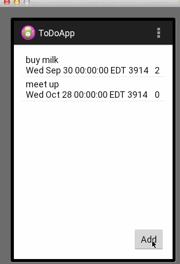

ToDoApp
=======

My first ToDo App with add and edit activities

User stories: 

*A user can add new items to the Todo list

*A user can edit an item by clicking it

Implemented extensions: 

*Persist the todo app in SQLite instead of using a text file

*Add support for completion due dates for items

*Add support for selecting a priority for items

*Change the item in ListView to display additional attributes, stylize the items

*Use a DialogFragment instead of new Activity for editing items

Time spent: 5 hrs (including installation)

Extensions- 10 hrs

Walkthrough of all user stories:

